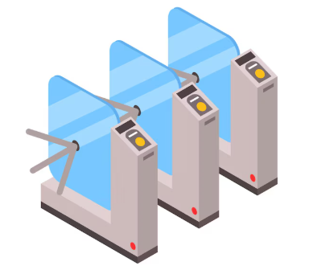
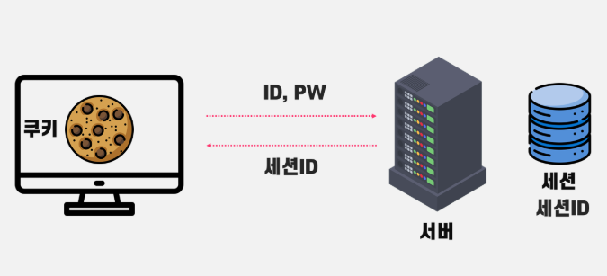
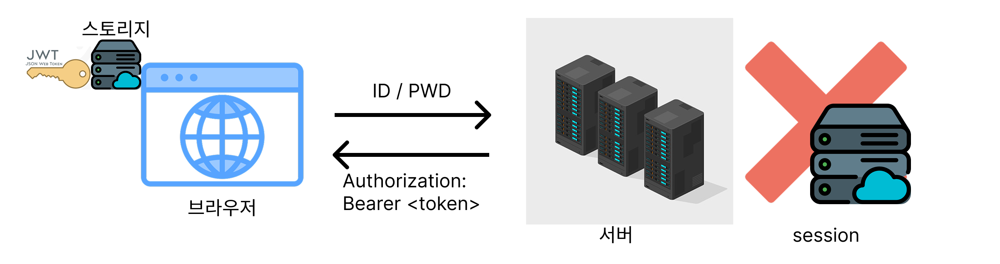
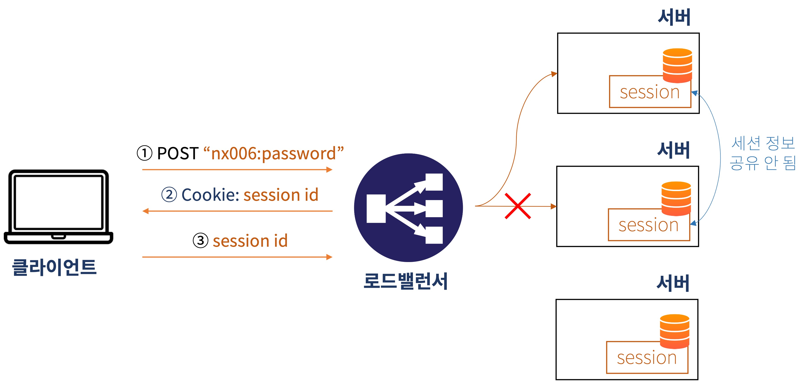

# 웹 애플리케이션 인증의 이해: 세션에서 JWT까지

## 1. 웹 인증의 기본 개념

### 1.1 인증 (Authentication) - "당신은 누구인가?"

* **정의:** 시스템에 접근하려는 주체(사용자 또는 다른 시스템)의 신원을 확인하는 절차이다.
    > 즉, 주체가 자신이 주장하는 그 대상이 맞는지 검증하는 과정이다.
* **목적:** 시스템에 등록된 합법적인 사용자인지를 식별하여 비인가 사용자의 접근을 원천적으로 차단한다.
* **예시:** 아이디/비밀번호 로그인, 공인인증서, OTP, 생체 인식, API 키 사용 등.

### 1.2 인가 (Authorization) - "당신은 무엇을 할 수 있는가?"

* **정의:** 인증된 주체가 특정 리소스(데이터, 페이지, 기능 등)에 접근하거나 특정 작업을 수행할 수 있는 권한이 있는지 검사하고 허용하거나 거부하는 절차이다.
    > 즉, 인증된 주체의 권한을 확인하는 절차이다.
* **목적:** 사용자의 역할이나 정책에 따라 접근 가능한 범위를 제한하여 시스템의 자원과 데이터를 보호한다.
* **예시:** 사용자 등급별 페이지 접근 제한, 관리자 기능 접근 제한 등.
* **관계:** 일반적으로 인증 절차가 성공적으로 완료된 후에 인가 절차가 진행된다.

### 1.3 인증 방식의 분류: 상태 유지(Stateful) vs 상태 비저장(Stateless)

서버가 클라이언트의 이전 요청 정보를 기억하는지 여부에 따라 인증 방식은 크게 상태 유지 방식과 상태 비저장 방식으로 나뉜다.

* **상태 유지 (Stateful) 인증:** 서버가 클라이언트의 인증 상태 정보를 세션 저장소 등에 지속적으로 저장하고 관리하는 방식이다.
  * 대표적으로 세션 기반 인증이 있다.
* **상태 비저장 (Stateless) 인증:** 서버가 클라이언트의 인증 상태를 저장하지 않고, 각 요청을 독립적으로 처리하는 방식이다. 필요한 모든 정보는 클라이언트가 요청 시 함께 제공한다.
  * 대표적으로 토큰 기반 인증(JWT 등)이 있다.

## 2. 전통적인 인증 방식: 세션 기반 인증

세션 기반 인증은 오랫동안 웹 애플리케이션에서 사용되어 온 서버 중심의 상태 유지(Stateful) 인증 방식이다.

### 2.1 동작 원리

1. **로그인 및 세션 생성:** 사용자가 로그인에 성공하면, 서버는 해당 사용자의 정보를 세션 저장소(메모리, DB 등)에 저장한다.
2. **세션 ID 발급:** 서버는 생성된 세션에 대한 고유한 식별자(세션 ID)를 생성하여, HTTP 응답 시 쿠키(예: `JSESSIONID`)에 담아 클라이언트에게 전달한다.
3. **세션 ID 활용:** 클라이언트는 이후 모든 요청에 해당 세션 ID가 담긴 쿠키를 함께 전송한다.
4. **인증 처리:** 서버는 수신된 세션 ID를 이용해 세션 저장소에서 사용자 정보를 조회하여 인증 상태를 확인하고 요청을 처리한다.

### 2.2 주요 특징

* **상태 유지 (Stateful):** 서버가 사용자의 인증 상태를 직접 저장하고 관리한다.
* **서버 부하:** 사용자 수가 증가할수록 세션 저장소의 메모리 사용량이나 조회 부하가 증가할 수 있다.
* **확장성 제약:** 여러 서버 인스턴스로 확장(Scale-out) 시 세션 불일치 문제를 해결하기 위한 추가적인 세션 클러스터링 기술(예: Sticky Session, Session Clustering, 세션 스토리지 외부화)이 필요하다.
* **보안 고려:** 쿠키 기반이므로 CSRF(Cross-Site Request Forgery) 공격에 취약할 수 있어 별도의 방어 메커니즘이 필요하다.

## 3. 현대적인 인증 방식: JWT 토큰 기반 인증

JWT(JSON Web Token) 토큰 기반 인증은 상태 비저장(Stateless) 아키텍처에 적합하며, 특히 모바일 환경, SPA(Single Page Application), 마이크로서비스 환경에서 널리 사용되는 인증 방식이다.

### 3.1 JWT의 등장 배경 및 필요성

전통적인 세션 기반 인증은 서버 확장 시의 복잡성, 모바일 앱과 같이 쿠키 사용이 제한적인 환경에서의 적용 어려움 등의 한계를 가졌다.  
또한, 다양한 플랫폼과 서비스 간 인증 연동을 위한 표준화된 방식이 부족했다.

이러한 배경 속에서 클라우드 환경과 마이크로서비스 아키텍처(MSA)가 확산됨에 따라, 서버가 클라이언트의 상태를 저장하지 않는 상태 비저장(Stateless) 방식의 중요성이 커졌다.  
JWT는 이러한 상태 비저장 아키텍처의 요구를 충족시키며, 웹 서비스 간 또는 다양한 클라이언트와 서버 간에 정보를 안전하고 효율적으로 교환하기 위한 표준화된 토큰 형식(RFC 7519)으로 등장했다.

### 3.2 JWT (JSON Web Token)란 무엇인가?

JWT는 인증에 필요한 정보들을 암호화된 것이 아닌, 서명된 JSON 객체 형태로 담아 안전하게 전송하기 위한 간결하고 자체 포함적인(self-contained) 방식의 토큰이다.

#### 3.2.1 JWT 구조

JWT는 마침표(`.`)로 구분되는 세 부분으로 구성된다: **헤더(Header)**, **페이로드(Payload)**, **서명(Signature)**.

* **형태:** `xxxxx.yyyyy.zzzzz`
  * `xxxxx`: Base64Url 인코딩된 헤더
  * `yyyyy`: Base64Url 인코딩된 페이로드
  * `zzzzz`: 서명

* **헤더 (Header): 토큰의 유형과 서명 알고리즘 정보**
  * **역할:** 토큰의 종류(일반적으로 "JWT")와 서명 생성 및 검증에 사용될 암호화 알고리즘을 명시한다.
  * **주요 필드:**
    * `alg` (Algorithm): 서명 알고리즘 (예: `HS256`, `RS256`). **필수 항목**.
    * `typ` (Type): 토큰 타입 (일반적으로 `"JWT"`).
  * **예시:** `{"alg": "HS256", "typ": "JWT"}`

* **페이로드 (Payload): 전달하려는 정보(클레임)의 집합**
  * **역할:** 토큰을 통해 실제로 전달하고자 하는 사용자 정보나 추가적인 데이터를 담는다. 이 안에 포함된 각 속성을 '클레임(Claim)'이라고 부른다.
  * **클레임 종류:**
    * **등록된 클레임 (Registered Claims):** 미리 정의된 권장 클레임 (선택적).
      * `iss` (Issuer): 토큰 발급자.
      * `sub` (Subject): 토큰 제목 (주로 사용자 식별자).
      * `aud` (Audience): 토큰 대상자.
      * `exp` (Expiration Time): 토큰 만료 시간 (NumericDate). **매우 중요**.
      * `nbf` (Not Before): 토큰 활성 날짜 (토큰 처리 가능 시작 시간).
      * `iat` (Issued At): 토큰 발급 시간.
      * `jti` (JWT ID): 토큰의 고유 식별자 (중복 방지용).
    * **공개 클레임 (Public Claims):** 사용자가 정의 가능하나, 충돌 방지를 위해 URI 형태로 네임스페이스 정의 권장.
    * **비공개 클레임 (Private Claims):** 클라이언트-서버 간 협의 하에 사용하는 클레임 (이름 충돌 주의).
  * **주의:** 페이로드는 암호화되지 않고 Base64Url 인코딩만 되므로, 민감한 정보(예: 비밀번호)는 직접 담지 않아야 한다.

* **서명 (Signature): 토큰의 무결성 검증 부분**
  * **역할:** 인코딩된 헤더와 페이로드, 그리고 서버만이 알고 있는 비밀 키(또는 개인 키)를 사용하여 생성된다. 이를 통해 토큰이 위변조되지 않았음을 보장하고, 특정 발급자에 의해 발급되었음을 증명한다.
  * **생성 과정:** `Base64UrlEncode(header) + "." + Base64UrlEncode(payload)` 문자열을 비밀 키와 함께 헤더에 명시된 알고리즘으로 해싱하거나 서명한다.
  * **중요성:** 서버는 JWT 수신 시 동일한 방식으로 서명을 다시 계산하여 전달받은 서명과 비교한다. 불일치 시 토큰은 유효하지 않은 것으로 간주된다. 이것이 JWT 보안의 핵심이다.

#### 3.2.2 서명 알고리즘

JWT 서명에는 다양한 암호화 알고리즘이 사용되며, 시스템의 구조와 보안 요구 수준에 따라 선택한다.

* **HMAC (대칭키):** `HS256`, `HS384`, `HS512` 등. 하나의 비밀 키를 서명과 검증에 모두 사용. 계산 속도가 빠르나, 키 유출 시 위험. 단일 시스템 또는 신뢰 관계가 구축된 환경에 적합.
* **RSA (비대칭키):** `RS256`, `RS384`, `RS512` 등. 개인키로 서명하고 공개키로 검증. 보안성이 높고 분산 환경에 적합하나, HMAC보다 느림.
* **ECDSA (비대칭키):** `ES256`, `ES384`, `ES512` 등. RSA보다 짧은 키로 유사한 보안 강도를 제공하며, 연산 효율성이 높을 수 있음.

#### 3.2.3 Base64Url 인코딩

JWT의 헤더와 페이로드는 JSON 데이터를 URL이나 HTTP 헤더를 통해 안전하게 전송하기 위해 Base64Url 방식으로 인코딩된다.  
이는 표준 Base64에서 URL에 사용 시 문제를 일으킬 수 있는 `+`, `/`, `=` 문자를 각각 `-`, `_`로 치환하고 패딩 `=`을 제거한 방식이다.  
Base64Url 인코딩은 암호화가 아니므로, 누구나 디코딩하여 내용을 확인할 수 있다.

### 3.3 JWT 토큰 기반 인증의 동작 원리

1. **로그인 및 토큰 발급:** 사용자가 로그인에 성공하면, 서버는 해당 사용자의 정보(예: 사용자 ID, 역할 등)를 담은 JWT를 생성하고, 비밀 키(또는 개인 키)로 서명한다.
2. **토큰 전달 및 저장:** 생성된 JWT는 클라이언트에게 전달되며, 클라이언트는 이 토큰을 안전한 곳(예: 브라우저의 로컬 스토리지, 세션 스토리지 또는 보안 설정된 HttpOnly 쿠키)에 저장한다.
3. **토큰을 이용한 요청:** 클라이언트는 이후 보호된 리소스에 접근할 때마다 HTTP 요청 헤더(주로 `Authorization: Bearer <token>`)에 JWT를 포함하여 서버에 전송한다.
4. **토큰 검증 및 인가:** 서버는 전달받은 JWT의 서명을 검증하여 토큰의 유효성과 무결성을 확인한다. 서명이 유효하면 토큰 내의 클레임 정보를 바탕으로 사용자를 식별하고 요청된 작업에 대한 인가를 처리한다.

### 3.4 JWT가 현대 웹 애플리케이션에 적합한 이유

* **상태 비저장(Stateless) 아키텍처 지원:**
  * 서버가 클라이언트의 상태를 기억할 필요 없이 각 API 요청을 독립적으로 처리할 수 있다.
  * 이를 통해 서버의 수평 확장(Scale-out)이 매우 용이해져 트래픽 증가에 유연하게 대응할 수 있으며, 서버 관리 및 배포가 단순화된다.
* **다양한 클라이언트 및 플랫폼 지원:**
  * 웹 브라우저(SPA 등)뿐만 아니라 모바일 앱(iOS, Android), 데스크톱 애플리케이션, IoT 기기 등 HTTP 통신을 사용하는 거의 모든 종류의 클라이언트에서 일관된 인증 방식을 사용할 수 있다.
* **마이크로서비스 아키텍처(MSA) 환경 최적화:**
  * 여러 개의 작은 서비스들이 독립적으로 운영되는 MSA 환경에서 JWT는 중앙 집중적인 세션 관리 없이도 서비스 간 사용자 인증 및 권한 정보를 안전하게 공유하고 전파할 수 있게 한다. API Gateway를 통한 인증 처리 후 내부 서비스들은 전달받은 JWT를 신뢰할 수 있다.
* **자체 포함적(Self-contained) 정보 및 효율성:**
  * JWT 페이로드에 필요한 사용자 정보, 권한 등을 담을 수 있어, 경우에 따라 추가적인 데이터베이스 조회 없이도 빠른 처리가 가능하다. (물론, 항상 최신 정보가 필요한 경우 DB 조회가 동반될 수 있다.)
* **인증 서버 분리 용이:**
  * 인증만을 전문적으로 처리하는 서버(Authorization Server)를 구축하고, 다른 서비스들은 이 인증 서버로부터 발급된 JWT를 신뢰하여 사용하는 구조(예: OAuth 2.0)를 만들기 용이하다.

## 4. 세션 기반 인증과 JWT 토큰 기반 인증 비교

| 구분          | 세션 기반 인증                             | 토큰 기반 인증 (JWT)                         |
| ------------- | ------------------------------------------ | -------------------------------------------- |
| **상태 관리** | 서버 (Stateful)                            | 서버는 Stateless (토큰 자체에 상태 포함 가능)   |
| **서버 저장소** | 세션 정보 저장 필요                        | 토큰 정보 저장 불필요 (리프레시 토큰은 예외적) |
| **확장성** | 상대적으로 복잡 (세션 클러스터링 등 필요)    | 용이                                         |
| **CORS** | 쿠키 사용 시 도메인 제약으로 CORS 설정 필요  | 헤더 방식 사용 시 상대적으로 자유로움        |
| **보안 고려** | 세션 하이재킹, CSRF                          | 토큰 탈취, XSS (토큰 저장 위치), 서명 키 관리 |
| **주 사용처** | 전통적인 웹 애플리케이션                   | SPA, 모바일 앱, 마이크로서비스 아키텍처(MSA)   |

---
